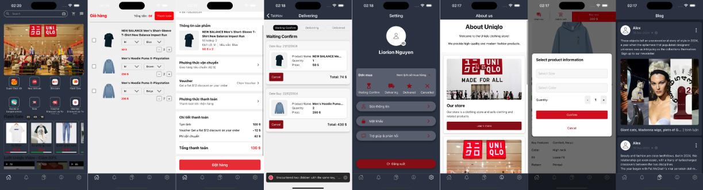

# UNIQLO - Ứng Dụng Bán Hàng Thời Trang

## Mô Tả:
UNIQLO là một ứng dụng di động được thiết kế để cung cấp trải nghiệm mua sắm thời trang tiện lợi cho người dùng. Ứng dụng cho phép người dùng duyệt qua các bộ sưu tập áo quần mới nhất, thực hiện đặt hàng và theo dõi đơn hàng một cách dễ dàng.

UNIQLO hoạt động tốt trên cả thiết bị iOS và Android.

**Các Tính Năng Chính:**
- Người dùng có thể xem các bộ sưu tập áo quần mới nhất và các sản phẩm được khuyến mãi.
- Người dùng có thể thêm sản phẩm vào giỏ hàng và thực hiện thanh toán một cách nhanh chóng.
- Tính năng theo dõi đơn hàng giúp người dùng cập nhật trạng thái đơn hàng của mình.

## Công Nghệ Sử Dụng:
* [React Native:](https://reactnative.dev/) Một framework hỗ trợ xây dựng ứng dụng di động đa nền tảng, đảm bảo trải nghiệm liền mạch trên cả thiết bị iOS và Android.
* [Redux:](https://redux.js.org/) Một thư viện quản lý trạng thái ứng dụng, giúp quản lý dữ liệu và trạng thái của ứng dụng một cách hiệu quả.
* [NativeBase:](https://nativebase.io/) Một thư viện UI cho React Native, cung cấp các thành phần giao diện người dùng có thể tái sử dụng và dễ dàng tùy chỉnh.

## [Cài Đặt App](https://expo.dev/artifacts/eas/iqbHEh9ia4r3Nsv4jQWNu7.apk)

# Demo
[(./)]()